# 1
---
## C++를 사용하는 이유
객체지향 프로그래밍을 할 수 있다.(하지만 C의 기초사항을 잘 알고 있어야 한다.)

## C++: 객체지향 프로그래밍

​	객체지향 프로그래밍은 데이터를 강조하여 절차지향 프로그래밍보다 규모가 큰 프로그래밍에서 이점을 가진다.
​	객체는 클래스에 의해 만들어지는 특정한 구조로, 예를 들어 어떤 회사에 근무하는 임원의 일반적인 특성을 클래스로 나타낼 수 있다.

## 프로그램 작성 요령
1. 손에 익은 텍스트 에디터를 사용하여 프로그램을 작성하고 파일로 저장한다.(이러한 파일을 소스코드라 한다)
2. 소스코드를 컴파일한다.(소스코드를 컴퓨터 내부에서 사용하는 언어로 번역)
3. 목적 코드에 부가적인 코드를 링크시킨다.(C++ 라이브러리 사용)

## 소스코드 파일 작성
​	소스코드의 파일 이름을 생성할 때 그 코드가 C++ 소스 코드라는 것을 나타냐기 위해 반드시 접미어를 붙일 필요가 있다.

​	여기서 접미어란 마침표(.) 뒤에 오는 연속된 문자을을 만하는데 이를 확장자라 한다.

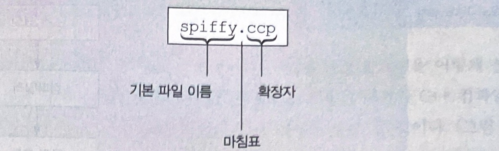

- 여러가지 C++ 컴파일러의 확장자

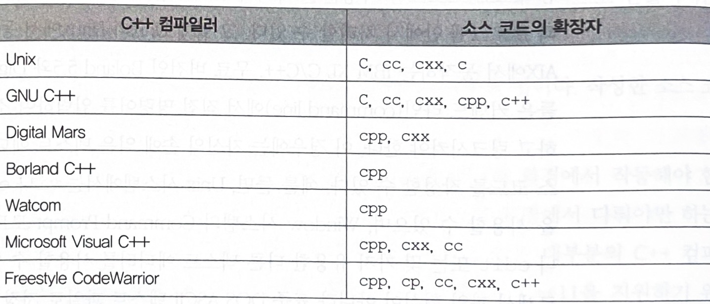

# 2
---
## C++ 프로그램의 구성요소

    //myfirst.cpp
    #include <iostream>
    int main()
    {
      using namespace std;
      cout << "C++의 세계로 오십시오.";
      cout << endl;
      cout << "후회하지 않으실 겁니다!" << endl;
      return 0;
    }  

- //로 시작되는 주석문
- #include 전처리 지시자
- 함수머리:int main()
- Using namespace 지시자
- {와}로 범위가 정해지는 함수 몸체
- C++의 cout 기능을 사용하여 메지시를 출력하는 구문들
- main() 함수를 종료하는 return 기능

## main() 함수

    int main()
    {
      구문들
      return 0;
    }

- 위에서 나오는 main()함수는 두 부분으로 이루어져 있는데, 이들이 함수 정의를 구성한다.

- 철 번째 행에 있는 int main() 이라는 부분이 함수 머리이고, 중괄호 { }로 묶여 있는 부분이 함수 몸체이다.

- 함수 머리는 이 함수를 프로그렘의 다른 부분과 연결하는 역할을 하고, 함수 몸체는 그 함수가 처리하는 동작을 컴퓨터에게 지시한다.

- C++에서 모든 구문은 세미콜론(;)으로 끝나야 하기에 프로그램을 작성할때 항상 세미콜론을 빠뜨리지 않도록 주의해야한다.

- main()함수같은 경우 int가 붙어있기에 리턴 값으로 정수값을 리턴할 수 있다.

- 빈 괄호는 이 함수가 어떠한 매개변수를 요구하지 않는다는 뜻으로 main 함수가 어떠한 정보도 전달받지 않지만. 그 함수에게 정수값을 리턴한다는 것을 알 수 있다.

- 모든 C++ 프로그램은 main() 함수로부터 실행을 개시하기에 대/소문자가 틀리거나 철자가 틀리면 안된다.

## C++ 주석문

- 주석문은 // 기호로 나타내며 프로그래머가 프로그램 안에 기록해 두는 일종의 메모이다.

- C++은 C 스타일의 주석문인 /* C 스타일 주석문 */ 도 인식할 수 있다.

## C++ 전처리기와 iostream파일

C++의 입출력 기능을 사용하려면 다음 두 행을 프로그램에 꼭 넣어야 한다.

    #include <iostream>
    using namespace std;

전처리 지시자인 #include 는 전처리기에 iostream파일의 내용을 프로그램에 추가하라고 지시한다.
- iosteram의 i는 input o 는 output 으로 C++의 몇가지 입출력 기능이 정의되어 있다.

## 헤더 파일 이름

위에서 소개한 iosteram파일을 포함파일, 또는 헤더파일이라 부른다.
헤더파일은 h 확장자를 사용했었지만 요즘엔 C의 헤더 파일에만 확장자 h 를 사용하고 C++ 헤더파일은 확장자를 사용않기로 했다.
다만 .h는 이 다음에 설명할 이름공간 기능을 포함하고 있다.

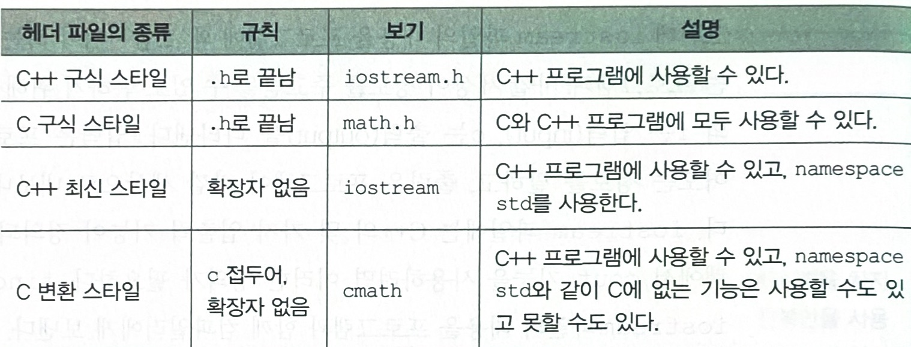

## 이름공간

iosteram.h 대신에 iostream을 사용할 때, 프로그램이 iostream의 정의를 사용할 수 있게 하려면 다음과 같은 이름공간 지시자를 사용해야 한다.

    using namespace std;

이름공간은 프로그램을 작성할 떄 여러 소프트웨어 개발업체들이 제공하는 코드들을 착오없이 사용할 수 있도록 도와준다.

cout와 endl은 std 이름공간에 정의되어있어 다음과 같이 사용할 수 있다.

    std::cout << "C++의 세계로 오십시오.";
    std::cout << std::endl;
## cout을 이용한 C++의 출력
- cout
  - cout는 문자열(string),수(number),문자(character) 들을 포함한 여러가지 다양한 정보들을 출력하는 방법을 알고있는 객체이고 다음과 같은 구문으로 문자열을 출력할 수 있다.

    cout << string;

  - 여기서 나온 삽입연산자(<<)는 오른쪽에 있는 정보를 스트림에 삽입시킨다 라는 의미를 가지고 있다.
- endl
  - endl은 조정자라 부르며 iostream 헤더 파일에 정의되어있고 std 이름공간에 속한다
  - endl은 cout구문 출력 문자열 끝에 있는 커서를 넘기는 역할을 한다.
  - 개행문자(\n)과 같은 기능을 한다.

## C++ 소스코드의 모양 
C++세미콜론이 구문의 끝을 나타내기에 빈칸이나 탭과 같은 방식을 다음과 같이 자유롭게 사용할 수 있다.

    #include <iostream>
      int
    main
    () { using
      namespace std;
      cout
        << "come up and C++ me some timd."
        ;  cout <<
        endl; cout <<
        "You won't regret it!" << endl
        ; return 0;  }

하지만 다음과 같은 예는 할 수 없다.

    int ma in()            // 이름안에 빈칸이 있어서 틀리다
    re
    turn 0;                //키워드 안에 캐리지 리턴이 있어서 틀리다
    cout << "Behold the beans
      of Beauty";          //문자열 안에 캐리지 리턴이 있어서 틀리다

- 토큰과 화이트 스페이스
  한 행의 코드에서 더 이상 분리할 수 없는 기본 요소를 토큰이라 한다.
  
  빈칸, 탭, 캐리지 리턴을 집합적으로 화이트 스페이스라 부른다.

  다음의 예는 화이트 스페이스를 언제 사용할 수 있고 언제 생략할 수 있는지 보여준다.

    return0;      //x
    return(0);    //o
    return (0);   //o
    return();     //x
    int main()    //o
    int main ( )  //o

- C++ 소스 코드 스타일
  - 한 행에 하나의 구문을 사용한다.
  - 함수를 여는 중괄호와 닫는 중괄호에 각각 한 행을 할애한다.
  - 함수 안에 들어갈 구문들은 중괄호에서 약간 오른쪽으로 들어간 위치에서 시작한다.
  - 함수 이름과 괄호 사이에는 어떠한 화이트스페이스도 넣지 않는다.

## C++ 구문
C++의 구문에는 두 종류의 구문인 변수를 선언하는 구문과 변수에 값을 대입하는 구문이 있다.

    int carrots;    //변수 선언
    carrots = 25;   //변수 대입
    cout << carrots;//cout에 변수 넘기기

## cin
cin은 키보드로 타이핑한 값을 프로그램에 넣어주는 input 값이다.

    cin >> carrots;

## cout에 의한 출력의 결합

    cout << "이제 당근은 모두";
         << carrots;
         << "개이다";

## 함수
C++의 함수는 리턴값이 있는 함수와 없는것 이라는 두가지 유형이 있다.
- 리턴값이 있는 함수

    x = sqrt(6.25);

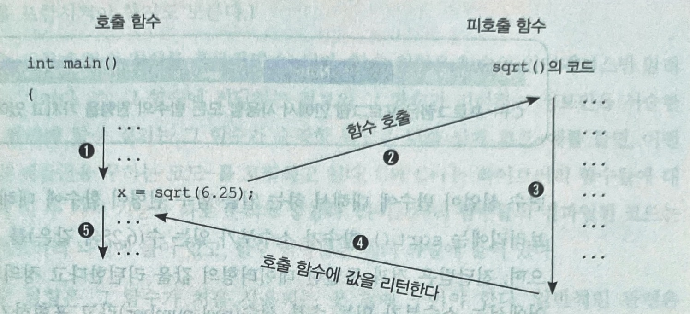

​	함수에 전달되는 값을 매개변수라 한다.(6.25)

위와같은 sqrt()함수를 이용하려면 두가지 방식이 있다.

- 함수 원형을 소스코드 파일에 직접 입력한다.
- 함수 원형이 들어 있는 cmath 헤더 파일을 포함시킨다.

## 사용자 정의 함수

사용자정의 함수는 그 함수의 원형을 main() 함수 앞에 두어야 하고 뒤에 새로운 함수를 위한 코드를 작성해야한다.

    void Simon(int)
    int main()
    {
      using namespace std;
      Simon(3)
      return 0;
    }
    void simon(int n)
    {
      using namespace std;
      cout<<"발가락을"<<n<<"번 두들겨라";
    }

위의 코드에서 using namespace std; 를 두번 적어야하는것이 번거롭다면 using namespace std; 를 밖으로 빼는 방법이 있다.

    using namespace std;
    int main()
    {
      내용
    }
# 3
---
## 데이터 처리 
C++ 에 내장된 데이터 형에는 기본형과 복합형이 있다. 이번에 알아볼 기본형에는 수형과, 소수점형이 있다.

## 변수 이름
C++에서는 변수 이름을 지을 때 간단한 규칙을 따라야 한다.
- 변수 이름에는 영문자, 숫자, 밑중 문자만을 사용할 수 있다.
- 숫자를 변수 이름의 첫 문자로 사용할 수 없다.
- 변수 이름에서 대문자와 소문자는 구별돤다.
- C++ 의 키워드는 변수 이름으로 사용할 수 없다.
- 두 개의 및줄 문자로 시작하는 이름이나, 밑줄 문자와 대문자로 시작하는 이름은, 그것을 사용하는 컴파일러와 리소스가 사용하기로 예약되어있다. 하나의 밑줄 문자로 시작하는 일름 또한 예약되어 있다.
- 변수 이름의 길이는 제한이 없고 변수 이름에 쓰인 모든 문자들이 유효하다.

## 정수형
정수는 2,98,-145,0 과 같이 소수부가 없는 수를 말한다.

signed 데이터형은 양수와 음수값을 모두 나타낼 수 있으니 unsigned 데이터형은 양수값는 나타낼 수 있다. 

정수를 저장하는데 사용되는 메모리가 클수록 폭이 넓어지는 데 정수형을 크기 순서로 나열하면 

char,short,int,long,long long

순이다.

이 기본형들에 대해 signed형과 unsigned형이 각각따로 존재하여 정수형은 총 여덟가지가 있는 셈이다.

  - short: 최소한 16비트의 폭을 가진다.
  - int: 최소한 short만큼은 크다.
  - long: 최소한 32비트 폭을 가진다.
  - long long: 64비트의 폭을 가진다.

int형이 컴푸터에서 가장 자연스러운 정수 크기로 설정괴어 가급적이면 int를 사용해야 한다.

- sizeof 연산자와 climits 헤더 파일
sizeof 연산자는 변수나 데이터형의 크기를 바이트 단위로 리턴해 준다.

climits는 여러가지 정수형들의 범위에 대한 정보가 들어있다.

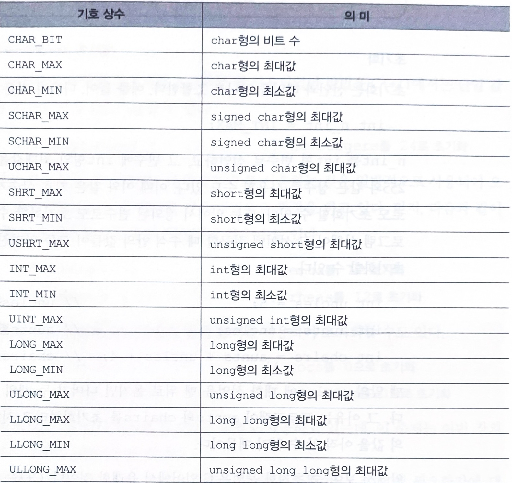

- 초기화
  초기화는 선언과 대입을 하나로 조합한다.

    int uncles = 5;                   // uncles를 5로 초기화
    int aunts = uncles;               // aunts를 5로 초기화
    int chairs = aunts + uncles + 4;  // chairs를 14로 초기화

## unsigned형
음의 정수값을 저장할 수 없는 형으로 short형이 -32768 에서 +32768까지의 범위를 갖는다면 unsigned short는 0부터 65545까지의 범위를 갖는다.

    //선언방법
    unsigned short change;
    unsigned int rovert;
    unsigned quauterback;
    unsigned long gone;

C++는 표현 한계값을 벗아날 때 부호없는 정수형의 경우에 다음과 같이 동작한다.

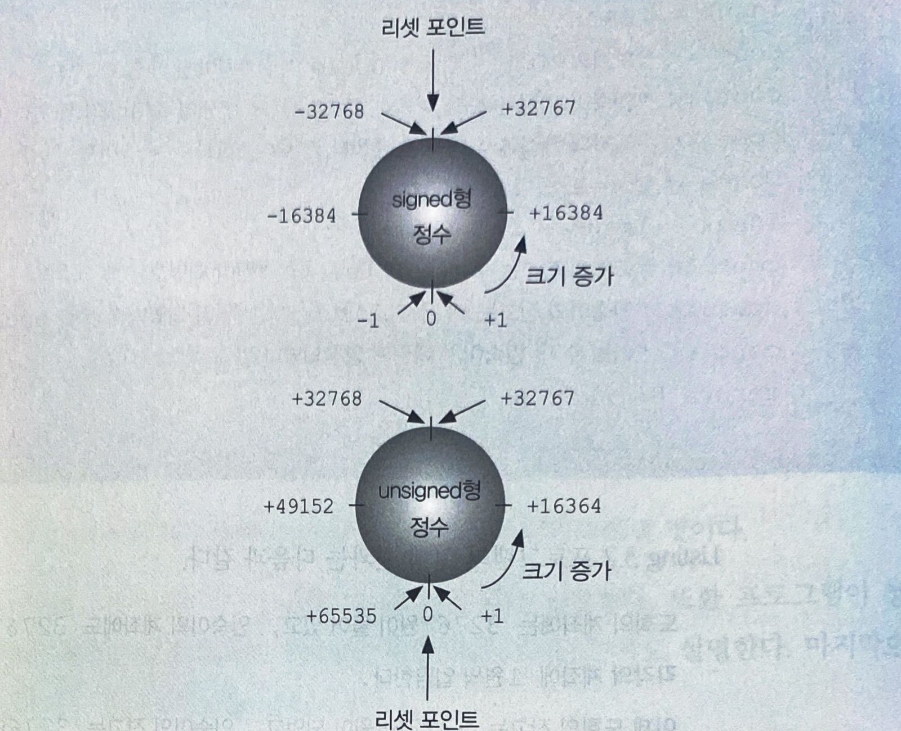

## char형: 문자와 작은 정수

char형은 문자와 숫자를 저장한다.

뒤에서 나오는 문자는 미국에서 사용하는 ASCII문자세트를 사용할것이다.

    char ch;
    cin >> ch;

저 ch 에 M을 넣는다면 M에 해당하는 수치 코드인 77이 ch에 같이 저장되어 이를 int형에 넣는다면 77이 반환될 것이다.

- 문자상수
문자상수는 ' ' 를 사용한다.

    'A' 는 65  //ASCHII 코드
    'a' 는 97
    '5' 는 53

- signed char형과 unsigned char형
int형과는 달리 char형은 signed형이나 unsigned형으로 미리 정해져 있지 않다.
- 확장 char형: wchar_t
보통의 8비트 char형으로 기본 문자세트를 나타낸다면 wchar_t형으로는 확장문자세트를 나태난다.(wide character type)

cin과 cout은 입력과 출력을 char형 문자의 스트림으로 간주하여 wchar_t형을 처리하지 못한다. 하지만 wcin과 wcout를 제공한다.

## bool형
bool형 변수는 참이나 거짓 중 어느 한 가지 값만 가질 수 있다.

C++는 0이 아닌 값들을 참으로 0인값을 거짓으로 해석한다.

    bool start = -100;     //true
    bool stop = 0;         //false

## const 제한자
기호상수를 만들어낸다.

    const int MONTHS = 12;

이 프로그램 안에서는 12대신에 MONTHS를 사용할 수 있다.

컴파일러는 이후에 기호상수를 변경하려는 어떠한 시도도 허용하지 않는다. 이떄문에 const는 제한자라고 부른다.

- const를 사용하면 좋은 이유
1. 데이터형을 명시적으로 지정할 수 있다
2. C++의 활동 범위 규칙에 의해 그 정의를 특정 함수나 파일에서만 사용할 수 있도록 제한할 수 있다.
3. 4장에서 설명할 배열이나 구조체와 같은 보다 복잡한 데이터형에도 const를 사용할 수 있다.

## 부동 소수점수

부동 소수점형은 소수부가 있는 수, 매우 큰 수, 매우 작은 수를 나타낼 수 있으며, 내부적으로 정수형과는 다른 방식으로 나타낸다.

## 부동 소수점수의 표기
C++가 부동소수점수를 표기하는 방법은 두 가지 이다.
1. 소수점 표기법을 그대로 따른다.
    12.34
    134.24
    8.0
2. 지수표기를 사용한다.

   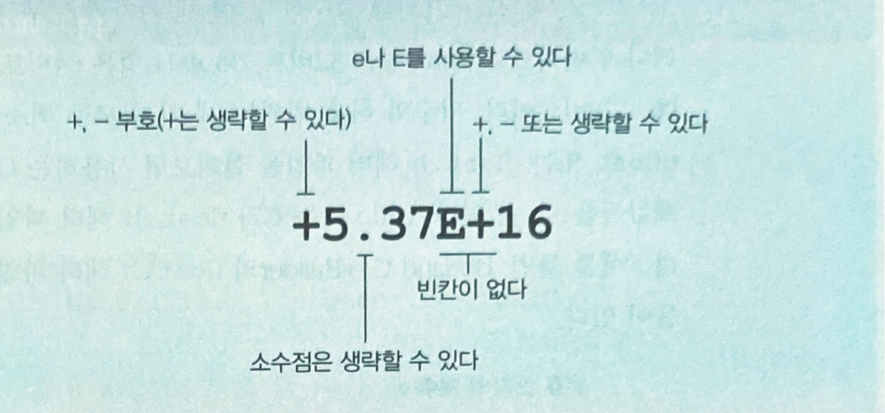
   E+n은 10의 n제곱을 나타낸다.

## 부동 소수점형

C++에는 float, double, long double의 세가지 부동 소수점형이 있다.

- float: 최소한 32비트
- double: float형보다 작지 않으면서 최소한 48비트
- long double: 최소한 double형과 같은 크기를 요구
## 부동 소수점수의 장단점
- 장점
  - 정수와 정수 사이에 있는 값을 나타낼 수 있다.
  - 스케일을 사용하여 매우 큰 범위의 값을 나타낼 수 있다.
- 단점
  - 부동소수점수 연산은 수치연산 보조 프로세서가 없는 컴퓨터에서 정수 연산보다 속도가 느리고 정밀도를 잃을 수 있다.

## C++ 산술 연산자
- (+) 연산자: 두 개의 피연산자를 더한다.
- (-) 연산자: 첫번째 피 연산자에서 두 번째 피 연산자를 뺸다.
- (*) 연산자: 두 개의 피연산자를 곱한다.
- (/) 연산자: 첫 번째 피 연산자를 두 번째 피연산자로 나눈다.
- (%) 연산자: 첫 번째 피 연산자를 두 번째 피연산자로 나누어 나머지를 구한다.

## 연산순서: 우선순위와 결합방향

    왼쪽 -> 오른쪽 결합방식

## 나눗셈에 대한 보충
나눗셈 연산자를 사용했을때 두 데이터형이 정수라면 소수부를 버리고 정수로 만든다.

    9/5 = 1

## 데이터형 변환
C++은 데이터형의 불일치를 해결하기 이ㅜ해 다음과 같은 상황에서 자동으로 데이터형 변환을 수행한다.
    - 특정 데이터형의 변수에 따른 데이터형의 값을 대입했을 때
    - 수식에 데이터형을 혼합하여 사용했을 때
    - 함수에 매개변수를 전달할때

C++에서는 대입될 변수의 데이터형으로 변환한다.

    // l은 long형, s는 short형
    s = l;    // short형

- 잠재적인 문제

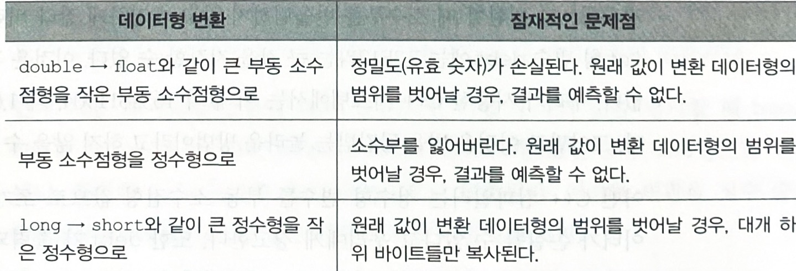

- 수식에서의 데이터형 변환
    - 하나의 연산에 두가지 데이터형이 들어 있으면 큰 크기의 데이터형으로 변환된다.
    - short 형이 int형보다 크기가 작을때 short형이 int형이 되는 정수 승급이 일어난다.

## C++11에서의 auto선언
C++11은 초기화 하는 값을 보고 변수형을 추론할 수 있어 초기화 선언시 데이터형을 쓰지 않고 auto를 사용할 수 있다.

    auto n = 100;      //n은 int
    auto x = 1.5;      //x는 double
    auto y = 1.3e12L;  //y는 long double

# 4
---

## 배열
배열은 데이터형이 같은 여러 개의 값을 연속적으로 저장할 수 있는 복합 데이터형으로 다음과 같은 세 가지를 선언한다.
  - 각 원소에 저장될 값의 데이터형
  - 배열의 이름
  - 배열 원소의 개수

    typeName arrayName[arraySize];

배열은 개별적은 접근을 허용하기 위해 인덱스를 사용하여 배열 원소에 차례로 번호가 매겨진다.

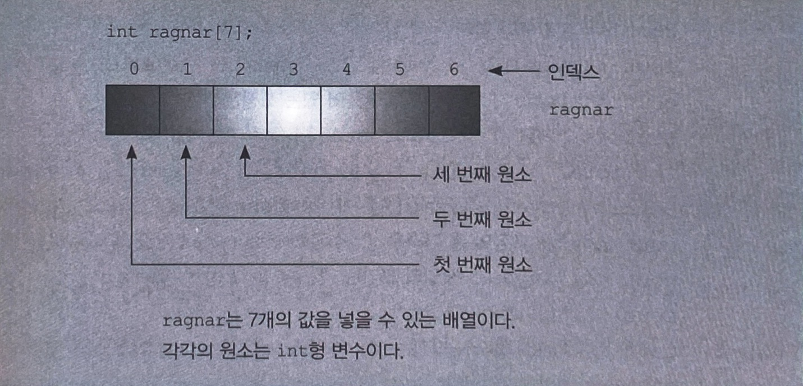

## 배열 초기화 규칙

배열의 초기화 형식은 배열을 정의하는 속에서만 사용할 수 있다.
초기화를 나중에 할 수는 없으며 배열을 다른 배열에 통째로 대입할 수도 없다.

    int cards[4] = {3,6,8,10};    //맞다
    int hand[4];                  //맞다
    hand[4] = {5,6,7,9};          //틀리다
    hand = cards;                 //틀리다

대괄호 속을 비워두면, 컴파일러가 초기화 값의 개수를 헤아려 원소의 개수를 결정한다.

    short things[] = {1,2,3,4};

## 문자열

    문자열이란 메모리에 바이트 단위로 연속적으로 저장되어 있는 문자들을 말한다.
    C에서는 문자열의 끝을 \0로 표시해야 했지만 큰따옴표("")로 묶는다면 문자열의 끝을 표시해주지 않아도 괜찮다.
    작은따옴표는 문자상수를 나타내기에 바꾸어 쓸 수 없다.

문자열을 저장할 char형의 배열은 그 크기가 끝내기 널 문자까지 포함하여 그 문자열에 들어있는 모든 문자들을 넣을 수 있을만큼 커야한다.

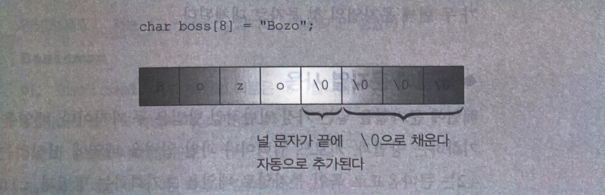

## 배열에 문자열 사용

1. 배열을 문자열 상수로 초기화하는 방법
2. 키보드 입력이나 파일 입력을 배열에 저장하는 방법 (cin 사용)

## string 클래스

    string 클래스는 배열보다 사용하기 쉬우며 문자열을 하나의 데이터형으로 나타낸다.
    string 클래스는 std 이름공간에 속해 있으므로 ,using 지시자를 사용하거나 std::string 을 사용해야한다.
    string 객체와 배열의 가장 큰 차이점은 string은 객체를 배열이 아니라 단순한 변수로 선언하는것이다.
    string 클래스는 하나의 string 객체를 다른 string 객체에 간단하게 대입할 수 있다.
    
    string name1 = "seowoo";
    string name2;
    name2 = name1;        //가능
    name3 = name1+name2;  //가능

## string 클래스의 조작

    strcpy(a,b);       // a에 복사한다.
    srtcat(a,c);       // a에 b를 추가한다.
    a = b+c;           // 위의 a와 동일

문자열 길이 구하기

    int len1 = srt1.size();    // srt1의 길이를 구한다.
    int len2 =  srtlen(charr1);// charr1의 길이를 구한다.

## string 클래스의 입출력
string 객체를 읽고 출력할 수 있지만 한번에 한 단어가 아닌 한 행을 읽을 때에는 다른 문법을 사용한다.

getline()<- 뭔소린지;

## 구조체

    서로 관련된 정보를 하나의 단위로 묶어서 저장할 수 있다.
    구조체 안에 여러 종류의 데이터를 저장할 수 있기 때문에 배열보다 융통성이 있다.

구조체 선언

    struct inflatable
    {
      char name[20];
      float volume;
      double price;
    };

이러한 템플릿을 만들면 그 데이터 형의 변수들을 생성할 수 있다.

    inflatable hat;
    inflatable woopie_cushion;

- 구조체 또한 다른 변수나 함수처럼 선언한 뒤에 내용을 작성한다.
- string클래스 객체는 string 클래스 멤버를 가진 구조체의 초기화를 지원하지 않는 낡은 컴파일러를 사용하지 않는 경우라면 가능하다.

## 구조체의 배열
구조체의 배열을 만드는 방법은 기본 데이터형의 배열을 만드는 것과 같다.

    inflatable structName[n];    //inflatable형 구조체 100개의 배열

구조체 배열 초기화 방법

    infaltable guests[2] = 
    {
    {"bambi",0.5,21.99},
    {"Godzilla",2000,565.99}
    };

## 공용체 

    공용체(union)는 서로 다른 데이터형을 한 번에 한 가지만 보관할 수 있는 데이터 형식이다. 
    공용체의 크기는 가장 큰 멤버의 크키가 된다.
    공용체를 사용하면 메모리를 절약할 수 있다.

## 열거체
열거체인 enum은 기호 상수를 만드는 것에 대한 또 다른 방편을 제공한다. 

    enum spectrum {red, orange, yellow, green, blue, violet, indigo, ultraviolet};

  - spectrum을 새로운 데이터형의 이름으로 만든다.
  - red, oragne...등을 0에서 7까지의 정수 값을 각각 나타내는 기호상수로 만든다.

열거체는 대입 연산자만 사용 가능하고 산술연산자는 허용되지 않는다. (하지만 일부 C++시스템은 이를 지키지 않는다.)

열거자의 값 설정

    //대입 연산자를 사용하여 열거자의 값을 명시적으로 지정할 수 있다.
    enum bits {one = 1,two = 2,four = 4,eight = 8};

## 포인터와 메모리 해제

    일반적인 변수에 대해 명시적으로 그 주소를 알아내는 방법으로는 주소 연산자(&)를 변수 앞에 붙이는 방법이 있다.
    포인터는 이러한 주소를 저장하게 되는 특별한 데이터형의 변수이다.
    *를 포인터 앞에 붙이면 포인터 주소에 저장되어있는 값이 된다.

## 포인터의 선언과 초기화
포인터 선언

    //포인터의 *은 앞이나 뒤에있는 빈칸을 무시한다. 따라서
    int* p1; 
    //이런 구문이 성립된다.

포인터 초기화

    int number = 1;
    int * pt = &number;
    // 이 프로그램을 실행시켜보면 *pt가 아닌 pt가 number의 주소로 초기화 되었음을 알 수 있다.

## new를 사용한 메모리 대입
new 연산자는 어떤 데이터형의 메모리를 원하는지 알려주면 그에 알맞은 크기의 메모리 블록을 찾아내고 그 블록의 주소를 리턴한다.

어떤 단일 데이터 객체를 저장하기 위해 메모리를 확보하고, 그 주소를 포인터에 대입하는 일반적은 형식은 다음과 같다.

    typeName * pointer_name = new typeName;

여기서 데이터 형을 두 번 사용한다.
1. 요구하는 메모리의 종류를 지정하기 위해 사용
2. 다른 한 번은 적당한 포인터를 선언하기 위해 사용

## delete를 사용한 메모리 해제
delete연산자는 사용한 메모리를 다시 메모리 풀로 환수한다.

    int * ps = new int;   // 메모리 대입
    ...                   // 메모리 사용
    delete ps;            // 메모리 해제

하지만 이미 해제한 메모리 블록을 다시 해제하려소 해선 안되고 new로 대입한 메모리가 아니면 안된다.

## new를 사용한 동적 배열의 생성

    프로그램이 실행될 때 배열이 사용이 되든 안되는 항상 메모리를 차지하는것을 정적 바인딩이라 한다. 
    new를 사용하여 배열을 실행시간에 생성하고 필요없으면 지울 수 있는 방식을 동적 바인딩이라 한다.

동적 배열 생성

    typeName * pointer_name = new type_name [num_elements];

동적 배열 해제

    delete [] pointer_name;

new 와 delete를 사용할 때 다음과 같은 규칙을 지켜야 한다.
1. new로 대입하지 않은 메모리는 delete로 해제하지 않는다.
2. 같은 메모리 블록을 연달아 두 번 delete로 해제하지 않는다.
3. new[]로 메모리를 대입한 경우에는 delete[]로 해제한다.
4. new를 대괄호 없이 사용했으면 delete도 대괄호 없이 사용한다.
5. 널 포인터에는 delete를 사용하는 것이 안전하다.

## 포인터, 배열, 포인터 연산
- 포인터의 연산
정수형 변수에 1을 더하면 값이 1만큼 증가한다. 그러나 포인터 변수에 1을 더하면 값이 그 포인터가 지시하는 데이터형의 바이트 수만큼 증가한다.

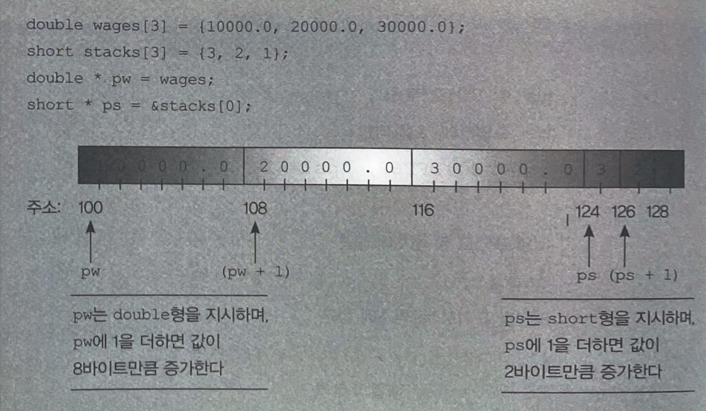

결과적으로 포인터에 1을 더하는 것은 그 배열의 다음차례 원소를 지시하게 된다.

    arrayname[i] = *(arrayname +i)
    pointername[i] = *(pointername + i)

## 포인터와 문자열

    프로그램에 안으로 문자열을 읽어드릴 때에는 언제나 미리 대입된 메모리의 주소를 사용해야 한다. 이 주소는 배열 이름 형식을 수도 있고 new를 초기화한 포인터 형식일 수도 있다.

strncpy()

    //strcpy()는 다음과 같은 방법에서 문제를 이르킨 수 있다.
    char food[20];
    strcpy(food, "a picnin basket filled with many goodies");
    //이는 strncpy를 사용하여 해결할 수 있는다. 바로 복사할 최대 문자수를 정하는 것이다.
    strncpy(food, "a picnin basket filled with many goodies",19);
    food[19] = '\0';

배열에 문자열을 대입할때는 strcpy()보다 strncpy()가 더 좋다.

## new를 사용한 동적 구조체의 생성
동적 구조체에는 이름이 없기에 도트(.)멤버 연산자를 사용할 수 없다. C++는 이 문제를 해결하기 위해 화살표 멤버 연산자(->)를 제공한다.

    struct inflatable
    {
      char name[20];
      float volume;
      double price;
    }
    int main()
    {
      ...
      cin.get(ps->name,20);    //멤버에 접근하는 방법 1
      ...
      cin >> (*ps).volume;     //멤버에 접근하는 방법 2
      ...
    }

- getname()
입력 문자열을 지시하는 포인터를 리턴한다.

## 자동 공간, 정적 공간, 동적 공간
- 자동 공간
자동 공간을 사용하는 함수 안에서 정의되는 보통의 변수들을 자동변수한다. 이는 자신이 정의되어 있는 함수가 호출되는 손간에 자동으로 생겨나 그 함수가 종료되는 시점까지만 존재한다.
- 정적공간
정적공간은 프로그램이 실행ㄱ되는 동안에 지속적으로 존재하는 공간을 말한다. 만드는 방법은 두가지인데, 하나는 외부에서 변수를 정의하는 것이고 하나는 static이라는 키워드를 붙이는것이다.
- 동적공간
new와 delete를 사용하여 만들고 어떤 함수에서 메모리를 대입하고 다른 함수에서 그것을 해제 가능하게 한다.

## 배열의 대안
- Vector 템플릿 클래스
Vector템플릿 클래스는 동적 배열에 속하는 string클래스와 유사하다. Vector객체를 사용하려면 vector 헤더 파일을 포함해야 하고 std 이름공간을 선언해 주어야 한다. 또한 템플릿은 저장된 데이터 형태를 지시하기 위해서 다른 수문을 사용한다.

    #include <vector>
    ...
    using namespace std;
    vector<int> vi;

- array 템플릿 클래스(C++11)

    array<typeName, n_elem> arr;

# 5
---
## for 루프
구조

    for(초기화;조건검사;갱신)
      내용

- for 루프의 각 부분
1. 조건 검사에 사용할 카운터 값을 초기화한다.
2. 루프를 진행할 것인지 조건을 검사한다.
3. 루프 몸체를 수행한다.
4. 카운터 값을 갱신한다.

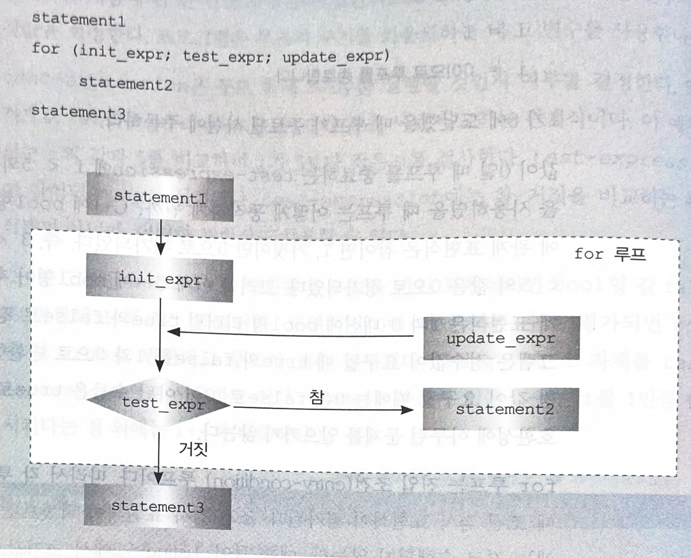

- 갱신 크기 변경
  보통의 루프들은 카운터를 매 주기마다 1씩 증가시키거나 감소시켰다. 그러나 갱신 표현식을 변경하면 카운터가 갱신되는 크기를 바꿀 수 있다.

    int by;
    cin>>by;
    for( int i = 0; i < 100; i = i+by)
      cout << i << endl;

- for 루프를 사용한 문자열 처리
  for 루프문을 사용하면 문자열을 구성하는 문자들에 차례대로 접근할 수 있다.

    string word;
    cin >> word;
    for (int i = word.size() - 1; i>=0; i--) <-- 증가연산자 : ++, 감소연산자 : --
      ocut << word[i];

   출력: animal
        lamina 

- 접두어와 접미어
  - x++ : 접미어
  현재 가지고 있는 x값을 먼저 평가한 수 x값을 증가시킨다
  - ++x : 접두어
  연제 가지고 있는 x값을 증가시킨 후 평가한다.

    x = 20;
    x++ = 20;
    x = 21;
    
    y = 20;
    ++y = 21;
    y = 21;

- 조합 대입 연산자
  | 연산자 | 효과 |
  | --- | --- |
  | += | L+R을 L에 대입 |
  | -+ | L-R을 L에 대입 |
  | *= | L*R을 L에 대입 |
  | /= | L/R을 L에 대입 |
  | %= | L%R을 L에 대입 |
  
- 관계표현식
  | 연산자 | 의미 |
  | --- | --- |
  | < | 작다 |
  | <= | 작거나 같다 |
  | == | 같다 |
  | > | 크다 |
  | >= | 크거나 같다 |
  | != | 같지 않다 |

흔히 범하는 실수

    musicians == 4;    //비교
    musicians = 4;     //대입

'같다' 연산자와 대입 연산자를 혼동해선 안된다.

- 문자열 비교 방법
strcmp()를 사용하여 C스타일 문자열이 같은지 검사하거나 선후 관계를 알아볼 수 있다.

   strcmp(str1,str2) == 0;    // 0 이면 거짓 1이면 참이다.

## while 루프
while루프는 for 루프에서 초기화 부분과 갱신 부분을 없애고 루프 몸체와 조건 검사 부분만 남겨놓은 것이다.

    while (test_experssion)
      body

    char name[ArSize];
    cin >> name;
    while (name[i] != '\0')
    {
      cout << name[i] << ":"<<int(name[i])<<endl;
      i++;
    }

    출력: Muffy
        M: 77
        u: 117
        f: 102
        f: 102
        y: 121

- 루프를 설계할떄 지침
  - 루프 실행을 종료시키는 조건을 파악한다.
  - 첫 번째 조건 검사를 하기 전에 그 조건을 초기화한다.
  - 조건 검사를 다시 하기 전에 매 루프 주기마다 그 조건을 갱신한다.

- do while 루프
do while 루프는 탈출조건 루프로 루프 몸체를 먼저 실행하고 조건을 나중에 검사한다는 뜻이다.

    do
      body
    while(test-expression)

    int n;
    do
    {
    cin >> n;
    } while(n!=7);          //나중에 조건 검사
    cout << "종료" <<endl;

    출력: 9
         4
         7
         종료

## Rnage 기반의 for 루프(C++11)
range안에 있는 모든 값들이 루프를 돌면서 출력돤다.

    double price[5] = {4.99,10.99,6.87,7.99,8.49}
    for ( double x : prices }
      cout << x << endl;

## 루프와 텍스트 입력
cin을 이용한 입력

    char ch;
    cin >> ch;
    while (ch!='#')
    {
      cout << ch;
      cin >> ch;
    }

    출력: see ken run#really fast
         seeoenrun

cin.get(char)을 이용한 입력
  - 위에와는 다르게 띄어쓰기까지 입력된다.
  
## 중첩 루프와 2차원 배열

2차원 배열은 앵과 열을 모두 가지고 있는 표를 연상하면 된다

    int maxtemps[4][5];

위의 구문은 4개의 원소를 갖는 배열이고 그 배열의 가가 원소는 5개의 정수를 저장할 수 있는 또 다른 배열이라는 뜻이다.

위의 배열이 들어 있는 모든 내용을 출력하려면 중첩 for루프를 사용하면 된다.

    for (int row = 0; row <4;row++)
    {
      for (int col = 0; col < 5; ++col)
      {
        cout << maxtemps[row][col] <<"\t";
      }
      cout << endl;
    }

2차원 배열 초기화

    int maxtemps[4][5] =
    {
      {94,98,87,103,101},
      {98,99,91,107,105},
      {93,91,101,104},
      {95,100,88,105,103}
    };

# 6 분기 구문과 논리 연산자
---
C++에서는 의사 결정을 구현하기 위해 if 구문과 switch구문을 제공한다.

## if 구문
C++프로그램은 특정한 행동을 수행할 것인지 말 것인지 선택해야 할 떄 if 구문을 사용한다.

    if(test_condition)
      statement

test-condition이 참으로 평가되면 statement를 수행한다.

예시

    char ch;
    int spaces = 0;
    int total = 0;
    cin.get(ch);
    while (ch !='.')
    {
      if(ch == ' ')
        ++spaces;      // 빈칸일때만 수행
      ++total          // 빈칸이든 아니든 매번 수행
      cin.get(ch)
    }
    cout << total<<","<<spaces;

    출력: Hello world
         11,1

- if else 구문

if else 구문은 두 개의 구문 또는 블록 중에서 어느 쪽을 수행할 것인지를 프로그램이 결정한다.

    if(test- condition)
      statement1
    else
      ststement2

if else 구문은 test-condition 이 참이면 statement1을 수행하고 아니면 ststement2를 수행한다.

- if else if else 구문

컴퓨터 프로그램에서 세 가지 이상 중 한 가지만을 선택해야 할때는 어떻게 해야할까.

    '''c++
    if(ch ++'A')
      a_arade++;
    else
      if(ch=='B')
        b_grade++;
      else
        soso++;
      '''

위 프로그램은 A가 아니면 else를 선택하게 되는데 이 else중에서도 두가지 분기가 나뉘어 세가지중 한가지를 선택할 수 있게 한다.

## 논리 표현식
C++에서는 하나 이상의 조건을 검사해아할 때 세 가지 연산자인 논리합, 논리곱, 논리부정을 사용한다.

- 논리합 OR 연산자(||)

or은 어느 하나 또눈 둘 다를 만족하는 경우를 나타낸다.

    5==5 || 5==9  //true
    5>3 || 5>10   //true
    5>8 || 5>10   //false

- 논리곱 AND 연산자(&&)

&&로 나타내는 노닐곱 연산다는 두 개의 표현식이 모두 true일 때에만 true 가 된다.

    5==5 && 4==4    //ture
    5==3 && 4==4    //false

- 논리부정 NOT 연산자(!)

! 연산자는 뒤따르는 표현식의 값을 반대로 만든다.

    if(!(x>5))    //x가 5보다 크지 않다면 true (x<= 5)

- 논리 연산자의 고려 사항

c++에서 논리곱 연산자와 논리합 연산자는 관계연산자보다 우선순위가 낮다.

    x>5 && x<10  == (x>5) && (x<10)    //위의 말은 다음과 같이 인식된다는 것을 의미함

여기서 논리부정 연산자는 어떠한 관계 연산자나 산술 연산자보다 우선순위가 높아 표현식을 소괄호로 묶어야 한다.

    !(x>5)    //x가 5보다 크다의 부정
    !x>5      //!x가 5보다 크다

논리곱 연산자는 논리합 연산자보다 우선순위가 높ㅍ아 다음과 같이 인식된다.

    age > 30 && age < 45 || weight > 300
    (age > 30 && age < 45) || weight > 300

- 논리 연산자의 대체 표기

| 연산자 | 대체표기 |
| --- | --- |
| (&&) | and |
|  | or |
| (!) | not |

## 문자함수를 위한 cctype 라이브러리

cctype 에는 어떤 문자가 대문자인지, 숫자인지, 구두점 문자인지 등을 판별하는 직업들을 간단하게 처리하는 함수가 있다.

    if(isalpha(ch))    // ch가 알파벳 문자인지 판별하는 코드
    if(isspace(ch))    // ch가 화이트 스페이스인지 판별하는 코드
    if(isdigit(ch))    // ch가 숫자인지 판별하는 코드
    if(ispunct(ch))    // ch가 구두점인지 판별하는 코드

## ?: 연산자
조건연산자(?:)는 if else 구문을 대신에 사용할 수 있는 연산자 이다.

    expression1 ? expression2 : expression3;

expression1이 true면 expression2의 값이 전체 조건 표현식의 값이 되고 false면 expression3의 값이 된다.

    5 > 3 ? 10 : 12      //true이므로 전체 표현식의 값은 10
    3 == 9 ? 25 : 18     //false 이므로 전체 표현식의 값은 18

## switch 구문
만약 5가지의 선택사항을 if else 구문으로 표현한다면 if else if else 구조를 길게 확장할 수 있지만, switch ㅜㅁ을 사용하면 쉽게 구현 가능하다.

    switch(integer-expression)
    {
      case label1 : statement(s)
      case label2 : statement(s)
      .
      .
      .
      default : ststement(s)
    }

integet-expression 에 해당하는 case로 도약하며 해당사항이 없을경우d default로 도약한다.

switch와 break 구문은 함께 사용된다.

    int choice;
    switch (choice)
    {
      case1: cout << "\a\n";
        break;
      case2: cout << "사장님은 오늘 회사에 계셨습니다.\n";
        break;
      dafault: cout<< "그것은 선택할 수 없습니다.";
        break;
    }

만약 break가 달려있지 않다면 해당되는 case부터 모든 구문을 실행할 것이다.

- 레이블을 열거자로 사용

switch 문은 열거자와 함께 사용할 수 있다.

    enum { red,orange,yellow,green} // 0부터 3까지 대응하는 이름이 있는상수
    int main()
    {
      int code;
      cin>>code;
      switch (code)
      {
        case red :...;
        case orange : ...;
        case yellow : ...;
        case green : ...;
      }
      return 0;
    }

## break와 continue구문
break와 continue구문은 프로그램이 코드의 일부를 무시하고 건너뛰게 만든다.

    for(int i = 0;line[i] != '\0';i++)
    {
      cout<<line[i];
      if(line[i] =='.')
        break;                // 문자가 마침표면 탈출한다. 루프에 나머지는 무시.
      if(line[i] != ' ')
        continue;             // 문자가 빈칸일 경우에만 수행한다.
    }

## 간단한 파일 입력/출력

- 텍스트 파일에 쓰기
  - fstream 헤더 파일을 포함시켜야 한다.
  - fstream 헤더 파일은 출력을 처리하 ofstream 클래스를 정의한다.
  - 하나 이상의 ofstream 변수 또는 객체를 선언할 필요가 있다.
  - std 이름공간을 지정해야한다.
  - 특정 ofstream 객체와 특정 파일을 연결시킬 필요가 있다. 그렇게 하는 한 가지 방법은 open()메서드를 사용하는 것이다.
  - 파일을 다루는 작업이 끝나며 close()메서드를 사용하여 그 파일을 닫아야 한다.
  - ofstream 객체를 << 연산자와 함꼐 사용하여 다양한 유형의 데이터를 출력할 수 있다.

ofstream 객체 선언 방법

    ofstream outFile;    //outFile은 ofstream 객체  
    ofstream fout;       //fout은 ofstream 객체

객체를 특정 파일에 연결하는 방법

    outFile.open("fish.txt");    // fish.txt에 쓰는 데 outFile사용
    char filename[50];
    cin >> filename;             // 사용자가 이름을 지정한다
    fout.open(filename);         // 지정된 파일을 읽는 데 fout사용

위의 객체를 사용하는 방법

    double wt = 125.8;
    outFile << wt;    // fish.txt에 하나의 수를 쓴다.
    char line[81] = "Objects are closer than they appear";
    fout << line << endl;

요약
    1. fstream 헤더 파일을 포함시킨다.                // #include<fstream>
    2. ofstream 객체를 생성한다.                    // ofstream outFile;
    3. ofstream 랠체를 파일에 연결한다.               // outFile.open("fish.txt);
    4. ofstream 객체를 cout과 동일한 방식으로 사용한다.  // outFile << "hello world" << endl;
    5. 파일 다루는 작업이 끝나면 close메서드로 파일을 닫는다.// outFile.close();

- 텍스트 파일 읽기
  - ifstream 객체를 >> 연산자와 함꼐 사용하여 다양한 유형의 데이터를 읽을 수 있다.
  - ifstream 객체를 get()메서드와 함께 사용하여, 개별적인 문자들을 읽을 수 있다.
  - ifstream 객체를 getline()메서드와 함께 사용하여, 한 번에 한 행의 문자들을 읽을 수 있다.
  - ifstream 객체를 eof()와 fail()과 같은 메서드와 함께 사용하여 입력 시도가 성공했는지 감시할 수 있다.
  - ifstream 객체 자체가 검사 조건으로 사용되었을 떄, 마지막 읽기 시도가 성공이면 bool값true로 변환되고 그렇지 않으면 false로 변환된다.
  
ifstream 객체 선언방법

    ifstream inFile;
    ifstream fin;

객체를 특정 파일에 연결하는 방법

    inFile.open("bowling.txt);
    char filename[50];
    cin >> filename;
    fin.open(filename);

객체를 사용하는 방법

    double wt;
    inFile >> wt;
    char line[81];
    fin.getline(line,81);

어떤 파일이 성공적으로 열렸는지 확인하는 방법은 is_open()이 있다.

    intFile.is_open()      //성공적으로 열렸으면 true를 리턴

# 7
---
## 함수
함수를 사용하기 위한 작업
  - 함수 정의 제공
  - 함수 원형 제공
  - 함수 호출

void형 함수의 일반적인 사용 형식

    void founctionName (paramenterList)
    {
      ...
      return;
    }

리턴값이 있는 함수의 사용 형식

    typeName founctionName(parameterList)
    {
      ...
      return value;
    }

함수는 return 구문을 수행한 후에 종료된다.

    int bigger(int a, int b)
    {
      if (a>b)
        return a;      //a가 b보다 크면 여기서 함수 종료
      else
        return b;      //b가 a보다 크면 여기서 함수 종료
    }

- 함수 원형

함수 원형은 컴파일러에게 함수의 리턴값의 데이터 형이나 매개변수의 개수와 데이터형을 알려주는 역할을 한다.

    #include <iostream>
    void cheers(int);          //함수 원형
    double cube(double x);     //함수 원형

함수 원형은 함수 머리에 ;을 추가하여 한든다. 굳이 변수 이름까지 지정할 필요는 없다.

함수 원형이 하는 일

    컴파일러가 함수의 리턴값을 바르게 처리한다.
    사용자가 정확한 개수의 매개변수를 사용했는지 컬파일러가 검사한다.
    사용자가 정확한 데이터형의 매개변수를 사용했는지 컴파일러가 검사한다.

## 함수 매개변수와 값으로 전달하기

매개변수는 전달되는 값을 넘겨받는 데 쓰이는 형식 매개변수와 함수에 전달되는 값인 실제 매개변수가 있다. 함수에 매개변수를 전달하는 것은 실제 매개변수를 형식 매개변수에 대입하는 것이다.

    double cube(double x);
    int main()
    {
      ...
      double side = 5;              //side라는 변수에 5를 대입
      double volume = cube(side);   //cube함수에 5를 전달
      ...
    }
    double cube(double x)           //x라는 변수를 만들고 5를 대입
    {
      return x+x;
    }

- 여러 개의 매개변수

함수는 하나 이상의 매개변수를 가질 수 있으면 함수 호출에서 매개변수들은 콤마로 분리한다.

    void functionName(typeName a,typeName b)
    functionName(a,b);

일반적인 변수 선언에서 가능했던 변수 선언의 결합이 여기서는 허용되지 않는다.

    void fifi(float a, float b)
    void fifi(float a,b)          //허용되지 않는다.

함수 원형에서는 변수 이름을 생략해도 된다.

    void n_chars(char,int);

## 함수와 배열

함수의 매개변수로 배열을 사용하기 위해서는 배열의 이름을 매개변수로 전달할 필됴가 있고, 크기에 제한을 받지 않기 위해 배열의 트기도 함꼐 전달해야 한다.

    int sum_arr(int arr[],int n)    //arr = 배열 이름, n = 크기

- 배열을 매개변수로 사용하는 것의 의미

    int sum_arr(int arr[],int n)        // arr은 *arr과 같다.

위의 코드에서 첫번째 매개변수인 arr배열은 포인터로 배열의 첫번쨰 원소의 주소를 알려준다. 배열의 주소를 매개변수로 사용하는 것보다 전체 열을 복사하는 것은 메모리나 시간을 더 소비하기에 주소를 사용함에 있어 더 이점이 있다.

- 배열 내용 출력과 const로 보호하기

출력이 배열의 원본을 변경시지 않게 하기 위해서는 const키워드로 배열을 보호하는 방법이 있다.

    void show_array(const double ar[],int n)

위 코드의 의미는 ar[0]와 같이 그 값을 사용할 수는 있지만 변경할 수는 없다.

- 배열의 수정

위 내용과 다르게 배열을 수정하려 한다면 const 키워드를 사용해선 안된다.

- 배열의 범위를 사용하는 함수

앞에서는 배열을 함수에서 사용하기 위해 배열의 시작 위치와 배열에 들어있는 원소 개수에 관한 정보를 넘겨 받았어야했지만 원소들의 범위를 지정하는 방법도 있다.

예를들어

    double dlbuod[20];

이런 배열이 있다고 가정해 보았을때 두 개의 포인터 elbuod, elbuod +20이 배열의 시작과 끝을 의미하여 범위를 지정한다.

    int arsize = 8;
    int sum_arr(const int * begin.const int * end);    //함수 원형
    int main()
    {
      int cookies[arsize] = {1,2,3,4,6,8,9,15};        
      int sum = arr_sum(cookies,cookies + arsize);      //배열의 범위를 넘겨줌
      ...
    }

- 포인터왜 const

포인터 매개변수를 const키워드를 사용하여 선언해야하는 이유는 두가지 이다.
- 실수로 데이터를 변경시키는 프로그래밍 에러를 막을 수 있다.
- const를 사용하는 함수는 const와 const가 아닌 매개변수를 모두 처리할 수 있지만 const를 생략한 함수는 const가 아닌 데이터만 처리할 수 있다.

따라서 가능하면 형식 포인터 매개변수를 const를 지시하는 포인터를 선언해야한다.

    const int months[12] = {31,28,31,30,31,30,31,31,30,31,30,31};      //const 사용
    int months1[12] = {31,28,31,30,31,30,31,31,30,31,30,31};           //const 사용안함
    int sum(int arr[], int n);                                         //const 사용안함
    int sum1(const int arr[],int n);                                   //const 사용
    ...
    int j = sum (months, 12);      //허용되지 않는다.
    int i = sum1(months, 12);      //허용된다.
    int k = sum1(months1,12);      //허용된다.

## 함수와 2차원 배열

1차원 배열에서와 마찬가지로 배열 이름에 해당하는 형식 매개변수는 포인터이다.

    int data[3][4] = {{1,2,3,4},{5,6,7,8},{9,10,11,12}};
    int total sum(data ,3);

다음과 같은 코드를 가지고 시작한다고 가정하자. 이때 함수 sum의 원형은 다음과 같다.

    int sum(int (*ar2[4],int size);

*ar2에는 괄호가 반드시 필요하다. 만약 괄호를 생략하고 선언한다면, 4개의 int값을 가진 배열을 지시하는 포인터를 선언하는 것이 아니라 int 값에 포인터 4개를 가지고 있는 배열을 선언하는 것이 된다.

    int sum(int ar2[][4]. int size);

다른 형식으로는 위와같은 형식이 있다.

- 행과 열

열의 수는 포인터가 지적하기에 위와같은 경우 4개의 열을 가지고 있다. 하지만 행은 변수 size로 지정되어 행의 수가 달라져도 동작한다.

사용하는 방법

    int sum(int ar2[][4], int size)
    {
      int total = 0;
      for (int r = 0; r < size; r++)
        for (int c = 0; c < 4; c++)
          total += ar2[r][c];
      return total;
    }

2차원 배열 속 원소를 모두 더하는 코드

    ar2[r][c] 는 *(*(ar2 + r) + c)로 나타낼 수 있다.

## 함수와 C스타일의 문자열

- C 스타일 문자열을 매개변수로 사용하는 함수

함수의 매개변수로 문자열을 나타내는 방법은 세 가지가 있다.
  - char형의 배열
  - 큰따옴표로 묶은 문자열 상수(문자열 리터럴)
  - 문자열의 주소로 설정된 char형을 지시하는 포인터

세 가지 모두 char 형을 지시하는 포인터로 문자열 처리 함수에 매개변수로 사용할 수 있다.

    char ghost[15] = "galloping";
    char * str = :galumphing";
    int n1 = strlen(ghost);      //ghost == &ghost[0]
    int n2 = strlen(str);        //char형을 지시하는 포인터
    int n3 = strlen("gamboling");//문자열 주소

매개변수로 문자열을 전달한다고 말할 수 있지만 실질적으론 문자열을 구성하는 첫 문자의 주소를 전달한다.

- C스타일 문자열을 리턴하는 함수

함수로는 문자열 자체를 리턴할 수 없기에 문자열의 주소를 리턴해야 한다.

    int main()
    {
      int times;
      char ch;
      ...
      cin >> ch;
      cin >> times;
      char * ps = buildstr(ch,times);
      cout << ps << endl;
    }
    char * buildstr(char c ,int n)
    {
      char * pstr = new char[n+1];
      pstr[n] = '\0';
      while(n-->0)
        pstr[n] = c;
      return pstr;
    }

    출력: v
    10
    vvvvvvvvvv

## 함수와 구조체
구조체는 보통의 변수처럼 함수에 값으로 전달할 수 있으며 리턴 가능하다.

- 구조체의 전달과 리턴

구조체의 정의

    struct name
    {
      typeName v1;
      typeName v2;
      ...
    };

위에서 구조체를 name으로 선언했기에 함수의 리턴값은 name 형 이어야 하고 함수에 전달되는 매개변수 또한 name 형 이여야 한다.

    name sum(name s1, name s2);

- 구조체 주소의 전달

구조체 전체 대신에 구조체의 주소만 함수에 전달하여 시간과 공간을 절약하고 싶다면 다음 세 사항을 변경해야 한다.
  - 함수를 호출할 때 구조체 대신에 구조체의 주소를 전달한다. (place 대신 &place)
  - name형 구조체를 지시하는 포인터, 즉 name * 형을 혁식 매개변수로 선언한다. 함수가 구조체를 변경하면 안되기에 const사용 권장
  - 형식 매개변수가 구조체가 아니라 포인터이므로 멤버연산자(.) 대신에 간접 멤버연산자(->)를 사용한다.

예시

    int sum (const name * s1,const name * s2)
    {
      int total;
      total = s1 ->v1 +s2->v1;
      return total;
    }

## 함수와 srting 클래스 객체
내장 데이터형을 다루는 것과 다름이 없다.

## 함수와 array 객체
array 는 다음과 같이 선언할 수 있다.

    std::array<double, 4> expenses;

위의  array 같은 경우 expenses를 함수로 보내야 한다. 만약 expenses 객체를 수정하는 함수를 원할 경우에는 &expenses 로 보내야 한다.

    functionName1(expenses);
    functionName2(&expenses);

expenses의 변수형은 array<double, 4>타입이기에 다음과 같이 함수 원형에 표시되어야 한다.

    typeName functionName1(std::array<double, 4> a1) // a1객체
    typeName functionName1(std::array<double, 4> a2) // a2객체에 대한 포인터

## 재귀 호출

C++함수는 자기 자신을 호출할 수 있는 능력을 가지고 있다. (main()함수 제외)

- 단일 재귀 호출

재귀 함수가 자신을 호출하면 계속 자신을 호출하게 되므로 호출에 연쇄를 끊기위해 if 문을 사용한다.

    void recurs(argumentlist)
    {
      ...1번
      if (test)
        recurs(arguments);
      ...2번
    }

if 구문이 참으로 유지되는동안 if구문의 1번 부분만 수행이 되고 recurs()함수호출로 진행된다. 

마지막 recurs()함수가 종료되면 바로 이전 단계의 recurs()호출로 넘어가 2번부분이 수행된다.

예시

    void countdown(int n);
    int main()
    {
      coutndown(4);
      return 0;
    }
    countdown(int n)
    {
      using namespace std;
      cout << "카운트다운..." << n << endl;
      if (n>0)
        countdown (n-1)
      cout << n << ": kaboom!"<<endl; 

    출력: 카운트다운...4
    카운트다운...3
    카운트다운...2
    카운트다운...1
    카운트다운...0    <- 마지막 재귀 호출
    0: kaboom!
    1: kaboom!
    2: kaboom!
    3: kaboom!
    4: kaboom!

- 다중 재귀 호출

재귀 호출은 하나의 작업을 서로 비슷 한 두 개의 작은 작업으로 반복적으로 분할해 가면서 처리해야 하는 상황에서 특별히 유용하다.

단일 재귀 호출을 유용하게끔 여러번 호출하는 것 인듯.

## 함수를 지시하는 포인터

일반적으로 사용자가 함수의 주소를 아는 것은 중요하지도 유용하지도 않다. 그러나 다른 함수의 주소를 매개변수로 취하는 함수를 작성하는 것과 같이 유요할 수도 있다.

- 함수 포인터의 기초

함수의 주소를 함수에게 전달하기 위해서는 다음과 같은 절차를 따라야 한다.
1. 함수의 주소를 얻는다.
2. 함수를 지시하는 포인터를 선언한다.
3. 함수를 지시하는 포인터를 사용하여 그 함수를 호출
  - 함수의 주소 얻기

  함수의 주소를 얻는것은 뒤에 붙는 괄호를 빼고 함수 이름만 사용하면 된다. 즉 think()가 함수라면 think는 그 함수의 주소이다

    process(think);    //process()에 think()의 주소를 전달한다.

  - 함수를 지시하는 포인터의 선언

  어떤 데이터형을 지시하는 포인터를 선언하려면 그 포인터가 어떤 데이터형을 지시하는지 지정해야 한다. 함수도 같다.

    double (*pf)(int);    //pf는 하나의 int를 매개변수로 취하고 double 형을 리턴하는 함수를 지시한다.

함수 포인터를 선언할 때는 연산자 우선순위 때문에 *pf를 괄호로 둘러싸야 한다. *연산자는 괄호보다 우선순위가 낮아서 *pf(int)는 pf()가 포인터를 리턴하는 함수라는 것을 의미하지만, (*pf)(int)는 pf가 함수를 지시하는 포인터라는 것을 의미한다.

    double (*pf)(int);    //pf는 double을 리턴하는 함수를 지시하는 포인터
    double *pf(int);      //pf()는 double형을 지시하는 포인터를 리턴하는 함수

pf를 바르게 선언한다면 일치하는 함수의 주소를 그것에 대입할 수 있다.

    double pam (int);
    double(*pf)(int);
    pf = pam;          // 리턴형이 일치해야 가능하다.

  - 포인터를 사용하여 함수 불러내기

  포인터를 사용하여 포인터가 지시하는 함수를 호출할 수 있다.

    double pam(int);
    double (*pf)(int);
    pf = pam;              //이제 pf는 pam() 함수를 지시한다
    double x = pam(4);     //함수 이름을 사용한 pam() 함수의 호출
    double y = (*pf)(5);   //포인터 pf를 사용한 pam() 함수의 호출

C++에서는 pf도 함수 이름처럼 사용하는 것을 허용한다.

    double y = pf(5);      //포인터 pf를 사용한 pam() 함수의 호출

- 함수 포인터의 변형

보충

- typedef를 이용한 단순화

C++은 auto외에 선언을 단순하게 할 수 있는 방법인 typedef 가 있다. typedef는 데이터 형에 가명을 붙일 수 있다.

    typedef double real;      // double에 real 이라는 가명을 만든다.
    real b;
    b = 3;

함수 포인터 형에 적용

    typedef const double *(*p_fun)(const double *, int);    //p_fun은 형 이름

## 참조 변수

참조는 미리 정의된 어떤 변수의 실제 이름 대신 쓸 수 있는 대용 이름이다.

예시

    int rats;
    int &rodents = rats;    //rodents를 rats의 대용 이름으로 만든다.rats 대신 rodents를 사용할 수 있다.

char * 가 문자를 지시하는 포인터를 의미하는 것처럼 int &는 int에 대한 참조를 의미한다.

    int rats = 101;
    int & rodents = rats;
    cout << rodents << endl;
    cout << rats << endl;
    int bunnies = 50;
    rodents = bonnies;
    cout << rodents << endl;
    cout << rats << endl;
    cout << bonnies << endl;

    출력: 101
    101
    50
    50
    50

위 코드를 보면 rodents의 값이 바뀌면 rats의 값도 같이 바뀐다는 것을 알 수 있다.

- 함수 매개변수로서의 참조

값으로 의 전달

    void sneezy(int x)
    int main()
    {
      int times = 20;
      sneezy(times);
      ...
    }
    void sneezy(int x)
    {
      ...
    }
    // 두 개의 변수 와 두 개의 이름이 만들어짐

참조로의 전달

    void sneezy(int x)
    int main()
    {
      int times = 20;
      sneezy(times);
      ...
    }
    void sneezy(int &x)    //x를 times의 대용 이름으로 만듬
    {
      ...
    }
    // 하나의 변수와 두 개의 이름이 만들어짐

값으로 전달되는 경우 복사본을 서로 주고 받지만 참조는 원본을 주고받는다.

- 참조의 특성

일반 매개변수와 참조 매개변수의 차이

    double cube(double a);
    double recube(double &ra);
    int main()
    {
      ...
      double x = 3.0;
      cout << cube(x);    // 일반 매개변수
      cout << " = " << x <<"의 세제곱" <<endl;
      cout << recube(x);  // 참조 매개변수
      cout << " = " << x <<"의 세제곱" << endl;
      ...
    }

    출력: 27 = 3의 세제곱
    27 = 27의 세제곱

출력값을 보면 참조 매개변수는 x의 대용 이름이기에 main에 있는 x 에게까지 영향을 주어 27의 세제곱 이라는 출력값이 나오게 된다.

- 임시 변수, 참조 매개변수, const

참조 매개변수가 const일 경우 컴파일러는 다음과 같은 두 가지 상황에서 임시 변수를 생성한다.
  - 실제 매개변수가 올바른 데이터형이지만 lvalue가 아닐 때
    - lvalue 매개변수는 변수, 배열의 원소, 구조체의 멤버, 참조 또는 역참조 포인터 등으로 참조가 가능한 데이터 객체이다.
  - 실제 매개변수가 잘못된 데이터형이지만 올바른 데이터형으로 변환할 수 있을 때
    - 예를 들어 double형 에대한 참조로 long형 데이터를 사용할 순 없지만, 올바른 데이터형으로 변환할 수 있어 임시 변수를 만든다. 

- 구조체에 대한 참조

기본 데이터형의 변수에 대한 참조를 선언할 떄와 마찬가지로 구조체 매개변수를 선언할 때 &를 앞에 붙이면 된다.

    struct name
    {
      ...
    };
    void functionName(name & a1);  //구조체에 대하여 참조를 사용
    void functionName(const name & a2)  // 구조체에 대하여 변경을 허용하지 않는다.

- 클래스 객체와 참조

string,iosteram...과 같은 클래스 객체를 매개변수로 취하는 함수들에 참조 매개변수를 사용할 수 있다.

    const string & functionName(string & s1,const string & s2);

- 참조 매개변수는 언제 사용하는가

참조 매개변수를 사용하는 주된 이유는 다음 두 가지이다
  - 호출 함수에 있는 데이터 객체의 변경을 허용하기 위해
  - 전체 데이터 객체 대신에 참조를 전달하여 프로그램의 속도를 높이기 위해 

참조와 포인터와 값의 전달의 사용 시기는 몇가지 지침을 다른다

함수가 전달된 데이터를 변경하지 않고 사용하는 경우:
  - 데이터 객체가 기본 데이터형이나 작은 구조체라면 값으로 전달한다.
  - 데이터 객체가 배열이라면 포인터가 유일한 선택이다.
  - 데이터 객체가 덩치가 큰 구조체라면 const 포인터나 const 참조를 사용하여 속도를 높인다.
  - 데이터 객체가 클래스라면 const 참조를 사용한다.  <-- 이것이 표준

함수가 호출 함수의 데이터를 변경하는 경우:
  - 데이터 객체가 기본 데이터형이면 포인터를 사용한다.
  - 데이터 객체가 배열이면 유일한 선택은 포인터를 사용하는 것이다.
  - 데이터 객체가 구조체이면 참조 또는 포인터를 사용한다.
  - 데이터 객체가 클래스 객체이면 참조를 사용한다.

## 디폴트 매개변수

디폴트 매개변수는 함수호출에서 실제 매개변수를 생략했을 경우에 실제 매개변수 대신 사용되는 값이다.

디폴트 값의 설정 방법

    cahr * left(const * str, int n =1);

함수 원형을 선언할 때 n = 1 이라는 디폴트 값을 설정해 주었다. 하지만 매개변수를 전달하면 새로운 값이 1을 대체한다.

    int harop(int n, int m = 4,int j = 5);    // 맞다.
    int choice(int n, int m = 6, intj);       //틀리다. 

디폴트 매개변수를 만들려면 그 매개변수보다 오른쪽에 있는 모든 매개변수를 디폴트 매개변수로 만들어야 한다.

    harpo(2);      //harpo(2,4,5)와 같다.
    harop(1,8);    //harpo(1,8,5)와 같다.

## 함수 오버로딩

함수 다형이라고도 불리우는 오버로딩은 서로 다른 여려개의 함수가 하나의 이름을 공유하는 것을 말한다.

함수의 매개변수 리스트를 함수 시그내처라고 하는데 시그내처의 종류와 개수가 서로 다른 함수들을 같은 이름으로 정의할 수 있다.

    void print (const char* str, int width);    // #1
    void print (double d, int width);           // #2
    void print (long l, int width);             // #3

    print ("pandakes",15);                      // #1
    print (1999.0,10);                          // #2
    print (1999L, 15);                          // #3

다음 두 선언은 공존할 수 없다.

    long gronk(int n, float m);
    double gronk(int n, float m); 
    // 같은 시그내처 이므로 공존할 수 없다

- 함수 오버로딩은 언제 사용하는가

    함수 오버로딩은 서로 다른 데이터형을 대상으로 하지만 기본적으로는 같은 작업을 수행하는 함수들에만 사용하는것이 바람직하며 과용하면 안된다.

## 함수 템플릿

함수 템플릿은 int형이나 double형과 같은 구체적인 데이터형을 포괄할 수 있는 일반형으로 함수를 정의한다.

    template <class Any>        // 키워드 template과 class를 반드시 사용해야 한다.
    void Swap(Any &a, Any &b)
    {
      Any temp;
      temp = a;
      a = b;
      b = temp;
    }

위와같은 함수 템플릿은 템플릿을 설정하고 임의 데이터형의 이름을 Any로 정한다는 뜻이다.

Any는 컴파일러 판단에 따라 int나 double같은 자료형으로 바뀐다.

예문

    template <class Any>
    void swap(Any &a, Ant &b);

    int main()
    {
      ...
      int i = 10;
      int j = 20;
      cout << i<<", "<<j<<endl;
      Swap(i,j)                  //Any -> int
      cout << i<<", "<<j<<endl;s

      double x = 24.5;
      double y = 81.7;
      cout << x<<", "<<y<<endl;
      Swap(x,y);                //Any -> double
      cout << x<<", "<<y<<endl;
      ...
    }

    template <class Any>
    void Swap(Any &a, Any &b)
    {
      Any temp;
      temp = a;
      a = b;
      b = temp;
    }

- 명시적 특수화

job 형을 위한 명시적 특수화

    struct job
    {
      char name[40];
      double salary;
      int floor;
    };
    template <> void swap<job>(job &, job &);

무슨소린지 잘 모르겠다

- 컴파일러는 어느 함수를 선택할까

함수 오버로딩. 함수 템플릿, 함수 템플릿 오버로딩등이 있기 때문에 어떤 함수 호출에 대해서 매개변수가 여러 개일 때, 어떤 함수 정의를 사용할 것인지 C++는 잘 짜여진 전략을 가지고 있다.

1. 후보 함수들의 목록을 만든다. 이들은 후촐된 함수와 이름이 동일한 함수와 템플릿들이다.
2. 여러 후도 함수들 중에서 계속 존속할 수 있는 함수들의 목록을 만든다.
3. 가장 적당한 함수가 있는지 판단한다. 그런 함수가 없으면 그 함수 호출은 에러이다.

적당한 함수를 판단할 때 형식 매개변수에 실제 매개변수를 대응시키기 위해서 컴파일러는 필요한 변환을 수행하는 데 순서대로 표시하면 다음과 같다.
1. 매개변수가 정확하게 대응하는 것.
2. 승급 변환(예를 들자면 float 을 double형으로)
3. 표준 변환 (예를 들면 int를 char로, long을 double로)
4. 클래스 선언에서 정의되는 변환과 같은 사용자의 정의 변환

- 정확한 대응과 최선의 대응

C++는 정확한 대응을 만들기 위해 몇가지 사소한 변환을 허용하는데 이는 밑에 표를 따른다.

|변환 전 실제 매개변수|변환후 형식 매개변수|
|---|---|
|Type|Type&|
|Type&|Type|
|Type []|* Type|
|Type (argument-list)|Type (*)(argument-list)|
|Type|const Type|
|Type|volatile Type|
|Type *|const Type|
|Type *|volatile Type *|

- 템플릿 함수의 발전

템플릿을 사용할 떄 서로 다른 자료형의 매개변수를 사용하려면 어떻게 해야할까.

    template <class T1, class  T2>
    void ft(T1 x, T2 y)
    {
      ...
    }

- decltype 키워드(C++11)

    int x;
    decltype(x) y;  //x와 동일한 타입의 y를 만들어라.
    decltype(x+y) xpy;  //  xpy를 x+y와 동일한 타입으로 만들어라

    double h(int x, floaty)  //이 함수의 원형은 다음의 구문으로 대체될 수 있다.
    auto h(int x, float y) -> double;
  
    // 여기에 decltype를 혼합한다면 다음과 같은 솔루션을 얻을 수 있다.
    template<class T1, class T2>
    auto gt(T1 x, T2 y) -> decltype(x+y)
    {
      ...
      return x+y
      ...
    }

